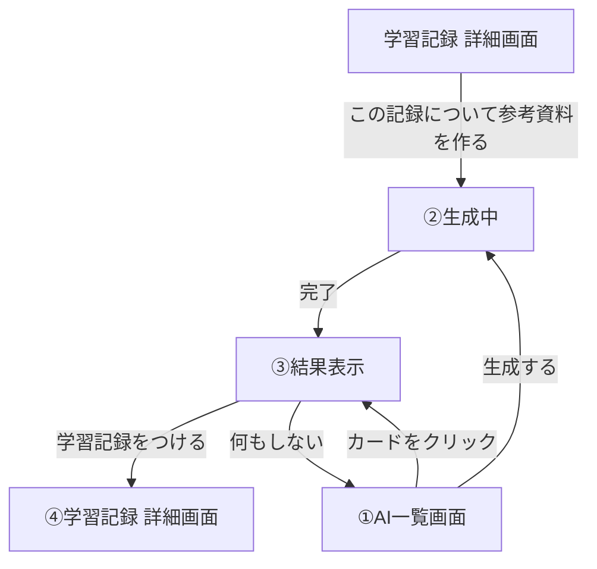

# AI 情報収集・提案 画面遷移図・画面イメージ（実装済み・2026-09-19）

詳細な入出力・APIは [overview.md](overview.md)、API仕様は [../api/request-response.md](../api/request-response.md) を参照。ここでは画面遷移と、各画面に実際に何が表示されるかを1枚にまとめる。

## 画面遷移図



## ①AI一覧画面（`/ai`）

```
┌──────────────────────────────────────────┐
│ AI 情報収集・提案                          │
│ [ 例：バックエンドを伸ばしたい（任意）_____ ] │
│                      [参考資料を生成する]   │
│                                             │
│ タグで絞り込み：[ すべて ▼ ]                │
│ ┌─────────────┐ ┌─────────────┐          │
│ │Spring Security│ │Docker        │  ← カード │
│ │9/18生成       │ │9/15生成      │          │
│ └─────────────┘ └─────────────┘          │
└──────────────────────────────────────────┘
```

- 保存済みの参考資料をカード（タグ・生成日時つき）で一覧表示
- タグ絞り込みセレクトを変えると`GET /api/ai/references?tag={tagId}`で絞り込む
- カードをクリックすると③に遷移（生成済みの内容をそのまま表示）
- `/ai?jobId=...`というURLで開いた場合（後述の学習記録詳細画面から遷移してきた場合）、最初から②の状態で始まる

## ②生成中（①と同じ画面内の状態）

```
┌──────────────────────────────────────────┐
│ AI 情報収集・提案                          │
│ [生成中...]（ボタンdisabled）              │
│ AIが検索・要約しています（数秒〜1分ほど）    │
└──────────────────────────────────────────┘
```

- `POST /api/ai/references`が返した`jobId`を`GET /api/ai/jobs/{jobId}`でポーリング中
- 完了した時点で、参考資料は`ai_references`に自動的に保存済みになる（＝①の一覧に出てくる）。この「参考資料として記録に残る」ことに、ユーザーの保存操作は要らない

## ③結果表示（①と同じ画面内の状態。カードクリック時も同じ表示）

```
┌──────────────────────────────────────────┐
│ <iframe>                                   │
│  Spring Securityの認可設定                 │
│  ……（要約本文HTML）……                    │
│ </iframe>                                  │
├──────────────────────────────────────────┤
│ 参考リンク                                  │
│ ・Spring Security Reference                │
├──────────────────────────────────────────┤
│ 別途、学習記録としても残したい場合           │
│ 内容：     [ 要約からの抜粋・編集可______ ] │
│ 学習時間： [ 5 ]分（編集可）                │
│ タグ：Spring Security（既存 or 新規作成される）│
│                        [学習記録をつける]   │
└──────────────────────────────────────────┘
```

- 学習記録には独立したタイトル欄が無いため（内容欄のみ）、フォームにもタイトル欄は無い。内容欄の初期値は「interest（またはタグ名）＋要約の抜粋」
- タグが既存タグに一致した場合はそのタグ名を表示するだけ。一致しなかった場合は「◯◯（新規作成されます）」と表示し、「学習記録をつける」を押した瞬間に初めて`POST /api/tags`でタグを作成する（タグの新規作成は非同期ジョブでは行わない。[../api/usecase.md](../api/usecase.md)のタグ分類の扱い参照）
- この画面が表示された時点で、参考資料自体はすでに`ai_references`に保存済み（②の完了時点で自動保存されているため）
- 「学習記録をつける」は、参考資料とは別物の`learning_records`に新しい1件を作る、完全に任意の追加アクション。押さなくても参考資料は消えず、①の一覧に残り続ける
- 押すと（必要ならタグ作成後に）`POST /api/learning-records`が呼ばれる。参考資料と学習記録の間にDB上の関連（外部キー）は持たせない（値をコピーして渡すだけ）

## ④学習記録 詳細画面（既存の`/records/{id}`。値が引き継がれた状態）

```
┌──────────────────────────────────────────┐
│ タグ：Spring Security                      │  ← タグ（③で確定したもの）
│ 学習時間：5分                              │  ← ③の値がそのまま保存されている
│ 学習日：2026-09-19                         │  ← 保存を押した日
│ ──────────────────────────                │
│ バックエンドを伸ばしたい / 要約からの抜粋…    │  ← 内容（③から引き継ぎ。タイトル欄は無い）
└──────────────────────────────────────────┘
```

- 画面自体は既存の学習記録詳細画面（新規で作る画面ではない）。③で保存したデータがそのまま表示される

## 学習記録 詳細画面からの生成（`/records/{id}`）

```
┌──────────────────────────────────────────┐
│ ← 戻る          [この記録について参考資料を作る] [編集] [削除] │
│ 2026-09-18                                 │
│ タグ：Spring Security                      │
│ ……学習記録の内容……                       │
└──────────────────────────────────────────┘
```

- 「この記録について参考資料を作る」を押すと`POST /api/ai/references`に`recordId`（この記録のID）を渡してリクエストする
- 受付が成功したら`/ai?jobId=...`へ遷移し、②生成中の状態から続きを見る（この画面自体はポーリングしない）
- この記録の内容は、Web検索クエリの組み立て・OpenAIへのプロンプトの両方で最優先の材料として使われる（直近の学習記録一覧は背景情報として別枠で併用される）
